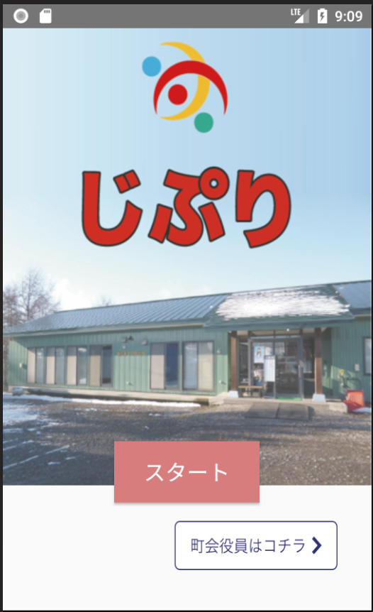
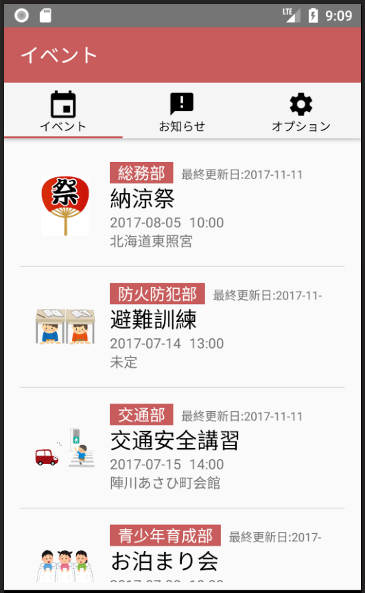
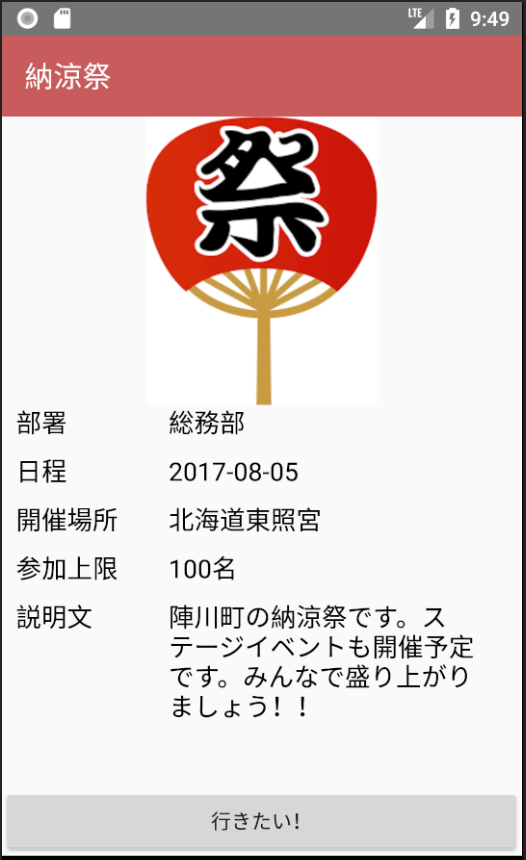
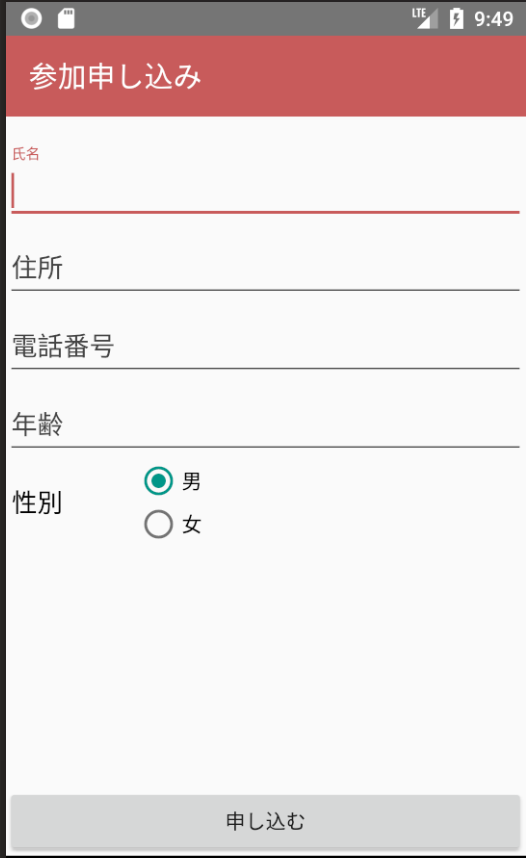

===========
Android
===========

開発環境
===========

Android版においては、以下の環境で開発を進めています。

**IDEと言語**

- Android Studio（バージョンあとで書く）
- Kotlin（バージョン後で書く）

**ライブラリ**

- NCMB (NCMB連携)
- gson (NCMBライブラリで要求)
- gms play-services-gcm:11.0.4 (プッシュ通知)
- okhttp:3.9.0 (http通信)
- picasso:2.3.3 (画像ダウンロード・キャッシュ)

仕様
=========

----

スタート画面
------------------------

画面仕様
~~~~~~~~~~~~~~

**画面の目的**

じぷりのスタート画面を表示し、ログイン画面への遷移を持つ

**画面への遷移方法**

- じぷりを起動する
- リスト画面・設定画面で戻るボタンを押す

**画面イメージ**

**遷移先画面**

- イベントリスト画面
- ログイン画面

機能仕様
~~~~~~~~~~~

この画面は特に機能とかはないです

イベントリスト画面
------------------

画面仕様
~~~~~~~~~~~~~~~

**画面の目的**

登録されているイベントのリストを表示する

**画面への遷移方法**

- スタート画面内で「スタート」ボタンを押す
- 画面下タブバーで「イベント」タブを押す
- ログイン画面で正しいアカウント情報を入力する（なんらかの役職持ちユーザーとしてログイン）

**画面イメージ**

**遷移先画面**

- イベント詳細画面
- イベント作成画面

機能仕様
~~~~~~~~~~~~~~

**リスト表示**

画面が生成されるタイミングでNCMBからイベントを読み込みます。
「役員のみ表示」がtrueになっているものがあれば、現在のログイン状況によってフィルタリングして表示します。

**イベント作成**

なんらかの役職持ちユーザーとしてログインしている場合、この画面からイベント作成画面に遷移することができるようになります。

**リスト更新**

イベントリストを下にスワイプすることで、イベントリストのデータを再読込する事ができます。

イベント作成画面
------------------

画面仕様
~~~~~~~~~~~~~~~

**画面の目的**

イベントを作成する

**画面への遷移方法**

- イベントリスト画面の右下のFabFloatingButtonをタップする

**画面イメージ**

.. image:: ../img/android_イベント作成画面.png

**遷移先画面**

- イベントリスト

機能仕様
~~~~~~~~~~~~~~

**イベント作成**

イベントを作成します。作成の際に入力が必要な情報は以下

- イベント名
- 発行部署名
- 場所
- 定員
- 開始日時
- 終了日時
- 申し込み締め切り日

必要な情報を入力した状態で「イベントを作成する」ボタンを押した場合、NCMBデータベース内Eventsテーブルに新しくレコードが作成されます。
イベントの作成が完了した場合、イベントリスト画面に遷移した後、SnackBarでその旨をユーザーに知らせます。

イベント詳細画面
------------------

画面仕様
~~~~~~~~~~~~~~~

**画面の目的**

イベントの詳細情報を表示する。表示する情報は以下

- イベント名
- 発行部署名
- 場所
- 定員
- 開始日時
- 終了日時
- 申し込み締め切り日

**画面への遷移方法**

- イベントリスト画面のリスト内で、任意のイベントセルをタップする

**画面イメージ**

**遷移先画面**

- イベント申し込み画面
- イベント編集画面
- 参加者リスト画面

機能仕様
~~~~~~~~~~~~~~

**イベント申し込み画面への遷移**

「行きたい！」ボタンをタップすると、そのイベントの申し込み画面へ遷移します。

**イベント編集画面への遷移**

なんらかの役職持ちユーザーとしてログインしている場合、この画面から右上のメニュー欄から選択することで、イベント編集画面に遷移することができるようになります。

**参加者リスト画面への遷移**

なんらかの役職持ちユーザーとしてログインしている場合、この画面から右上のメニュー欄から選択することで、参加者リスト画面に遷移することができるようになります。

イベント申し込み画面
-----------------------

画面仕様
~~~~~~~~~~~~~~~

**画面の目的**

イベントに対して参加申し込みを行う。

**画面への遷移方法**

- イベント詳細画面で、「行きたい！」ボタンを押すとこの画面に遷移できます

**画面イメージ**

**遷移先画面**

- イベントリスト

機能仕様
~~~~~~~~~~~~~~

**イベント申し込み**

イベント申し込みフォームに、

- 氏名
- 年齢
- 性別
- 住所
- 電話番号

を入力した後に「申し込む」ボタンをタップすると、イベントに参加を申し込むことができます。
入力された情報は、NCMBデータベース内のParticipantsテーブルに保存されます。
保存されたデータは、申し込んだイベントの参加者リスト画面から確認できます。

イベント編集画面
-----------------------

画面仕様
~~~~~~~~~~~~~~~

**画面の目的**

イベントの情報を編集・更新する

**画面への遷移方法**

- イベント詳細画面でメニュー内の「編集」を選択することで遷移できます

**画面イメージ**

.. image:: ../img/android_イベント編集画面.png

**遷移先画面**

- イベントリスト

機能仕様
~~~~~~~~~~~~~~

**イベント申し込み**

イベント申し込みフォームに、

- 氏名
- 年齢
- 性別
- 住所
- 電話番号

を入力した後に「申し込む」ボタンをタップすると、イベントに参加を申し込むことができます。
入力された情報は、NCMBデータベース内のParticipantsテーブルに保存されます。
保存されたデータは、申し込んだイベントの参加者リスト画面から確認できます。

参加者リスト画面
-----------------------

画面仕様
~~~~~~~~~~~~~~~

**画面の目的**

イベントの参加者リストを閲覧・外部に出力する

**画面への遷移方法**

- イベント詳細画面でメニュー内の「参加者リスト」を選択することで遷移できます

**画面イメージ**

.. image:: ../img/android_参加者リスト画面.png

**遷移先画面**

- なし

機能仕様
~~~~~~~~~~~~~~

**参加者リスト表示**

イベントに申し込みをした参加者のリストが表示されます。

**参加者リスト出力**

現在表示されている参加者リストのCSVをNCMBに保存した後、そのCSVデータを

- このアプリを起動している端末
- DropBox
- LINE

上記3つの保存先を選択して保存・共有することができます。
保存に成功した場合、SnackBarを用いてその旨をユーザーに知らせます。
